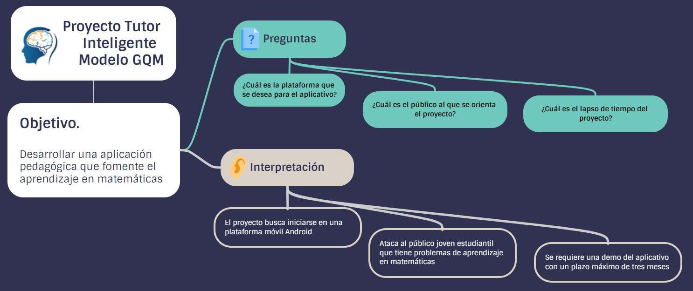

# TutorInteligente

Es una app que busca En Colombia, carreras de tipo ingenieril, están atravesando una crisis, el número de matriculados ha descendido de forma preocupante, una de las causas que aducen aquellos que no la eligen y quienes desertan, es la dificultad que les presenta todo el ciclo de materias relacionadas con las matemáticas (Serna & Serna, 2015). Todo el ámbito universitario pasa por un porcentaje de abandono alto, de un 48,8%, aún en programas con contenidos moderados de matemáticas y, de todas formas, se señala a estas como las causantes de una gran parte de la decisión de retirarse de las universidade.

Tutor inteligente es una app que busca saciar esto brindando pequeñas prácticas y cursos para que los estudiantes que hagan parte de la app puedan aprender y salir adelante en el mundo de las matemáticas

# Conclusiones del proyecto

Mediante la realización de este proyecto se pudo notar la importancia de conocer la necesidad del aprendizaje de matemáticas que existente en el mundo actual, determinar las necesidades del aprendizaje de las personas y como llevar estos conocimientos a una plataforma didáctica que fomenta hábitos de estudio por medio de herramientas tecnologías 
como lo es un aplicativo móvil, así mismo el desarrollo de los distintos sprints que le otorgan al proyecto una mayor fluidez y productividad a la hora de su desarrollo.	

